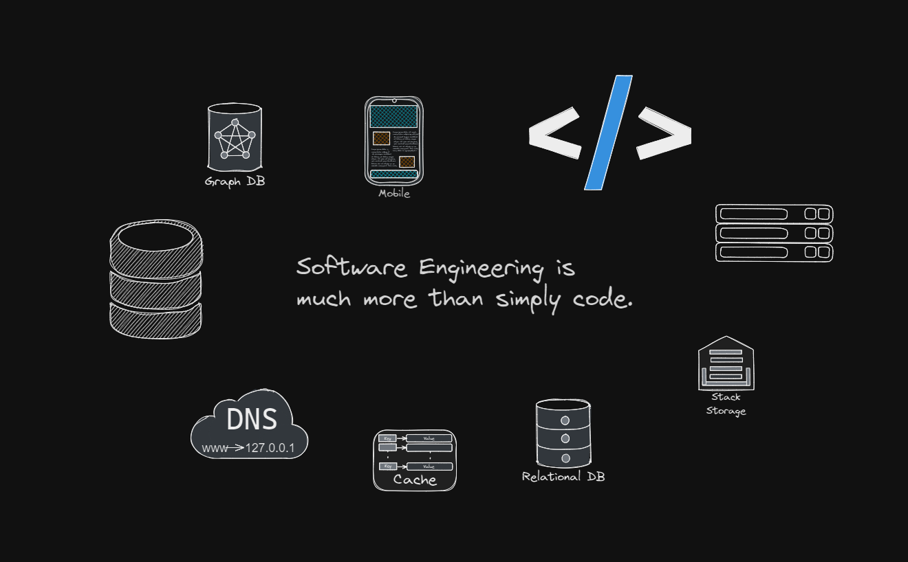

# Software Engineering Fundamentals

What if I could put all my learning into one single structure mono-repo? That is the basic goal for this repository. To put together various topics and divisions inside Software Engineering together as I move forward in my learning journey.

## Where do we start?

Starting from the very basics :
- Networking
- Data Structure
- Database
- Algorithm 
- Language

I believe these are the topics I am planning at the moment to learn and refresh, I consider they are the fundamental layers of software engineering, I will be randomly learning and populating these folders with data as my learning journey goes forward.

### Purpose 

The outcomes of this repositary will be avaibility of my own glossary and notes towards various subjects of Computer Engineering, It will enable me to learn linux as I am operating this complete project on an Ubunutu terminal. 

