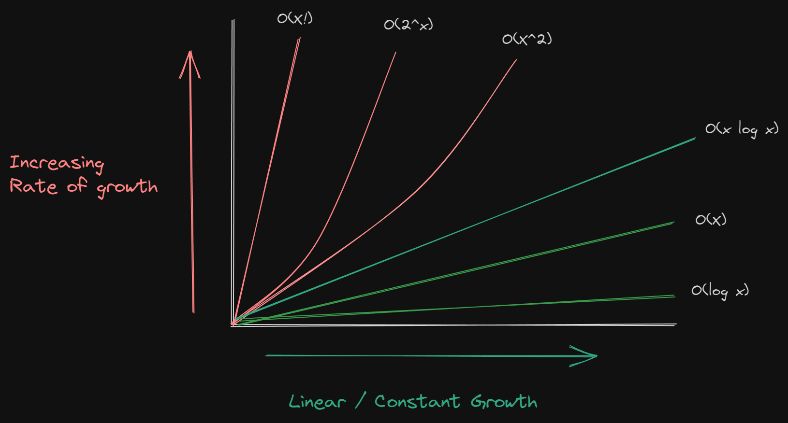

# Big O Notation

Big O notation is a special notation that tells you how fast an algorithm is by calculating the logorithm value of the complexity involved in each steps with inputs.

We look at runtimes in three sets of time complexity that is best, worst and expected cases.

Big O notation also considers space complexity parallely which means it also allows to determine the space needed at different steps of an alogrithm.

In simple words Big O notation tells you the speed of an algorithm not by litreally giving the time taken but by calculating the rate of growth.

One important concept in mathematics needed or required to understand Big O notation is [Logorithms](https://www.notion.so/Logarithm-Algebraic-Geometry-8abd211bfe994f10b4a229bbf48d2e13?pvs=21)

Big O looks into worst runtime possibility, It does consider average time, But worst case give reassurance it never goes beyond certain slowness.

There are five types of common run times : 

## O(*log* n) - Log time

## O(n) - Linear/Constant Time

## O(n * *log* n) - Fast sorting Algorithm

## O(n^2) - Slow sorting Algorithm

## O(n!) - Really Slow sorting Algorithm

It is possible for some runtimes to run faster than others, Big O just describes the **rate of increase.** For this reason we drop the constants in runtime. An algorithm described as O(2n) might simply be O(n). Always drop the constants.

The next thing to remember is drop the non-dominant terms, Any non dominant term becomes removed. O(n^2 + n^2) is still O(n^2).

Checkout this graph to understand the rate of increase at each runtime.

