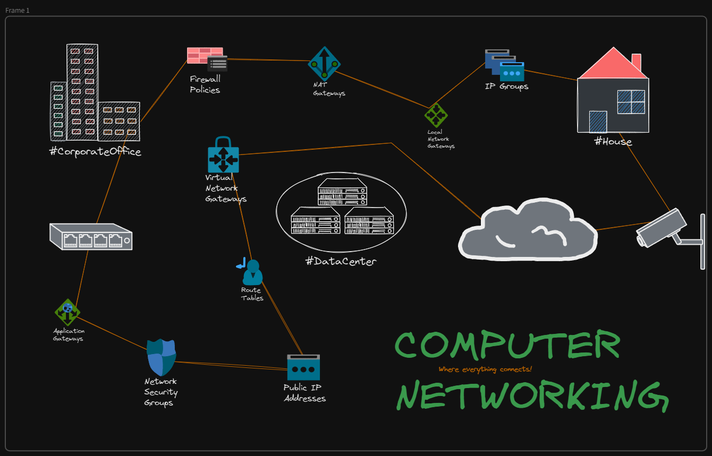

# Network Engineering

This part of the repositary deals with many fundamentals of network theories that every software engineer must understand to keep himself in the pool of depth towards his knowledge of computer science.
